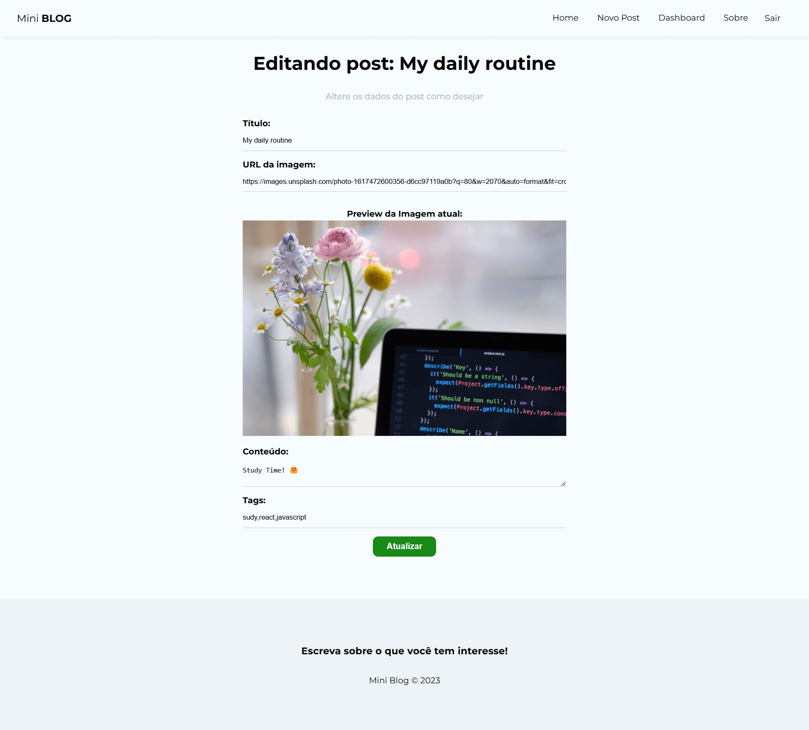

# MiniBlog

This project is a mini blog where users can create, edit, delete, view posts, search for content, and access other people's posts.

## Summary
- [Technologies](#technologies)
- [How to use](#how-to-use)

---




## 🛠 Technologies
- **React**
- **React Router**
- **Context**
- **Hooks**
- **Authentication**
- **Firebase**

---

## 🚀 How to use

### 1. **Download GitHub Project**
1. Click on the link to the project on GitHub.
2. Click on the green button **Code**, and after in download **Download ZIP**.
3. Extract the zip file into a folder on your computer.

---

### 2. **Install Node.js**
1. Download Node.js here: [https://nodejs.org/](https://nodejs.org/).
2. Install Node.js following the instructions.

---

### 3. **Settings file `.env`**
1. In the folder project, create a file name `.env`
2. Open the file with VS Code.
3. Full the Firebase settings:
   ```env
   REACT_APP_API_KEY=put-your-key-here
   REACT_APP_AUTH_DOMAIN=put-your-auth-domain
   REACT_APP_PROJECT_ID=put-your-project-id
   REACT_APP_STORAGE_BUCKET=place-your-storage-bucket
   REACT_APP_MESSAGING_SENDER_ID=put-your-sender-id
   REACT_APP_APP_ID=put-your-app-id
   ```
4. Save the file as `.env`

---

### 4. **Install dependencies**
1. Open terminal:
   - **Windows**: Click in the menu, type `cmd` and press Enter
   - **Mac/Linux**: Open terminal.
2. Go to the project folder:
   ```bash
   cd path/folder/project
   ```
3. Install dependencies project:
   ```bash
   npm install
   ```

---

### 5. **Run the App**
1. In the terminal, execute the following command:
   ```bash
   npm start
   ```
2. The project will be opened automatically in the browser.

---
